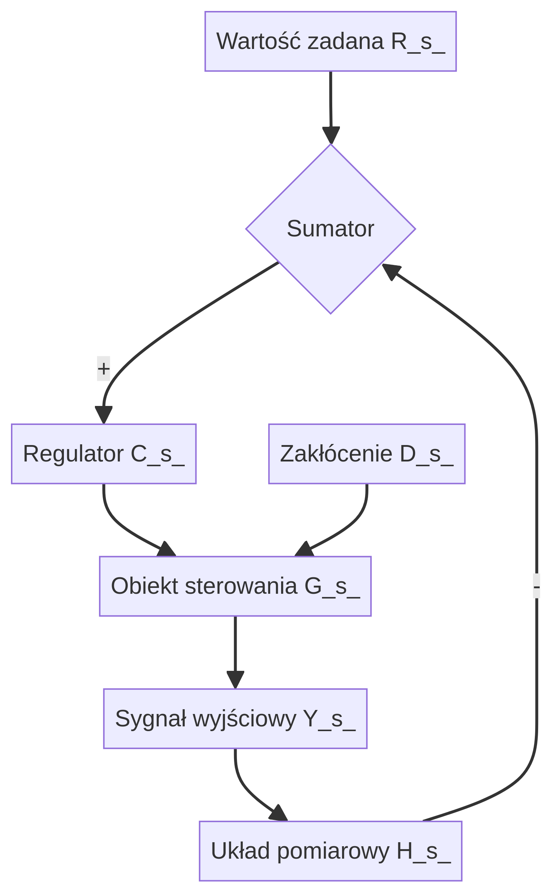
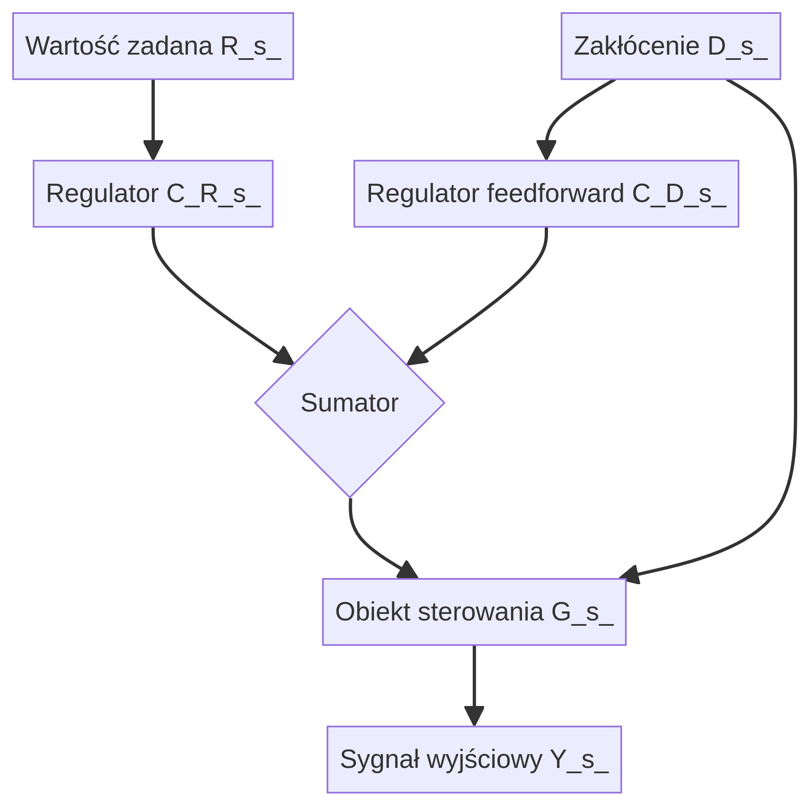
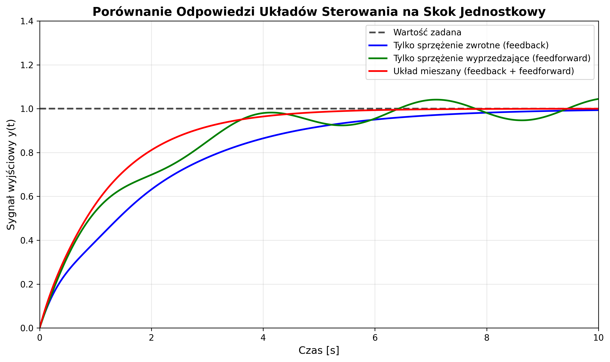
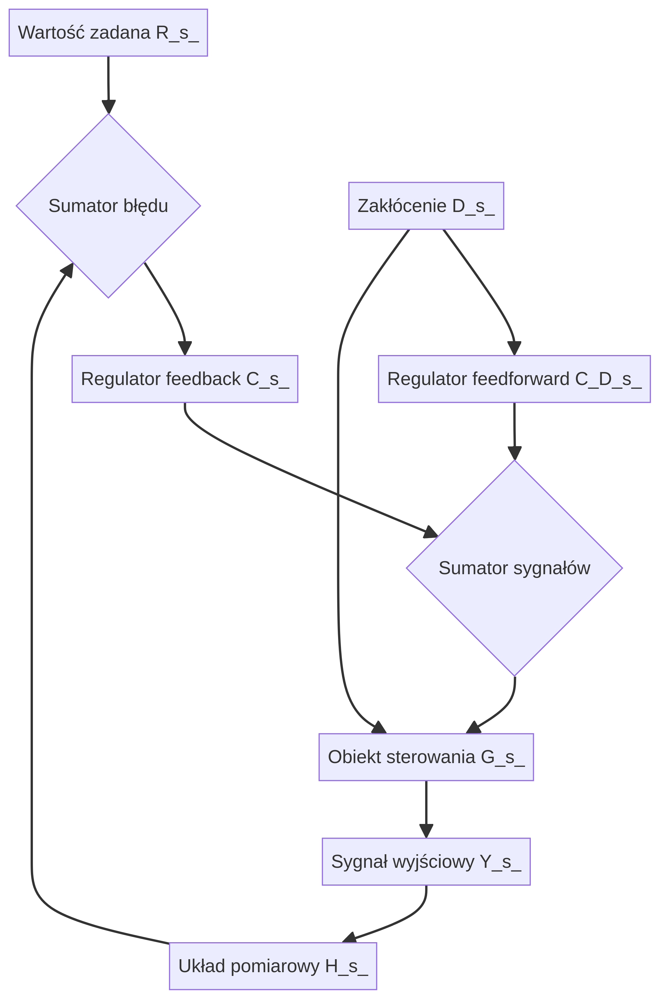
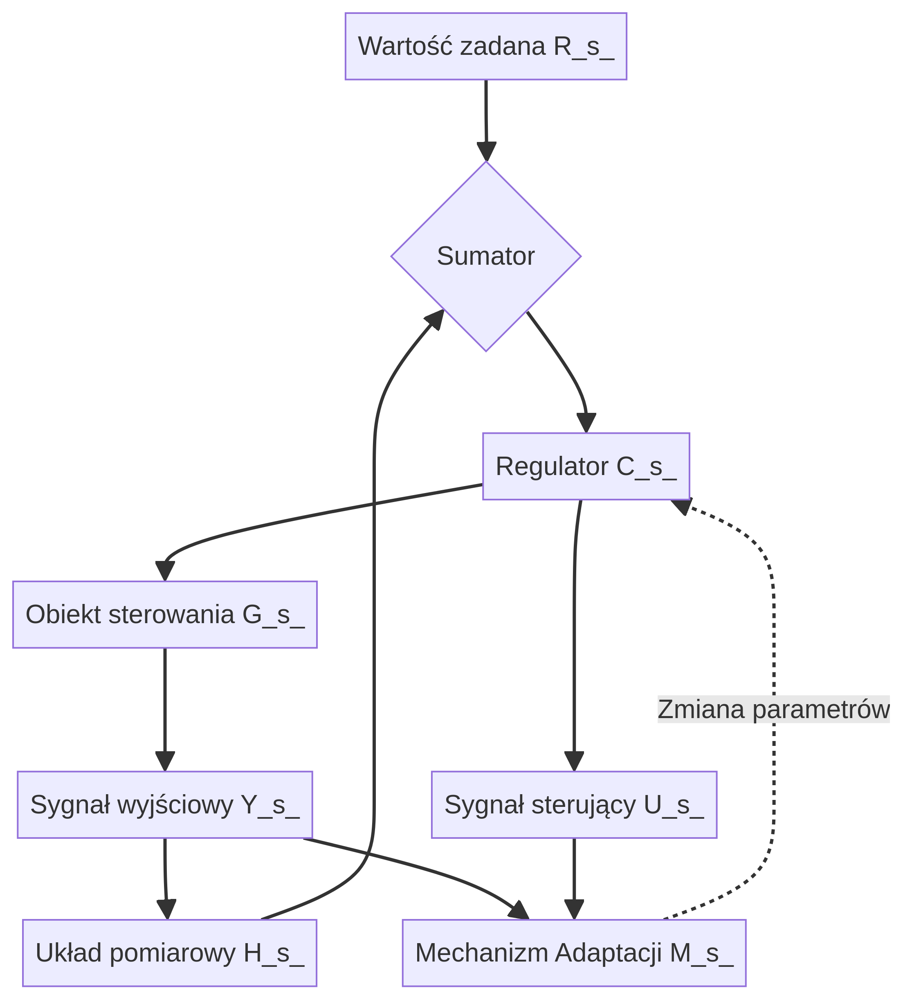
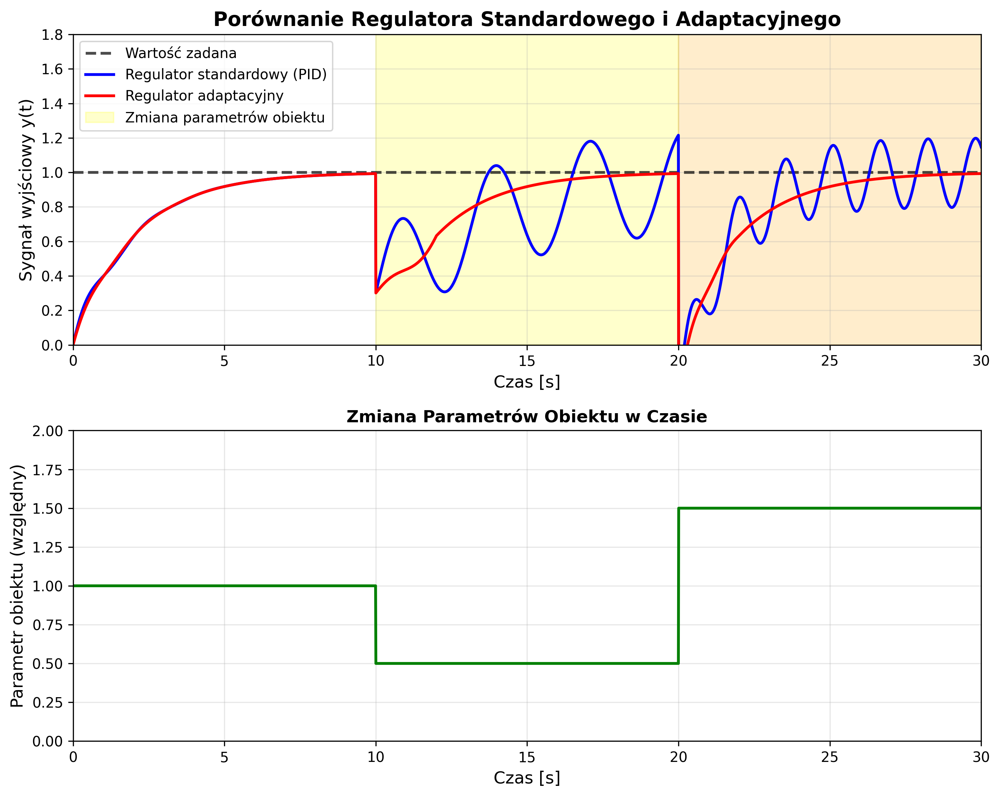
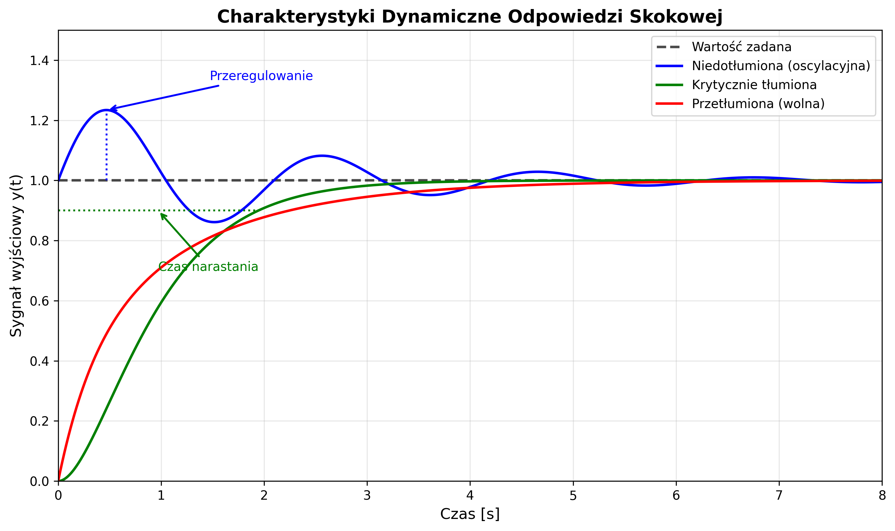

_**Zastrzeżenie:** Ten tutorial został wygenerowany przez sztuczną inteligencję i ma na celu dostarczenie ogólnych informacji na temat poruszanych zagadnień. Może zawierać uproszczenia i nie powinien być traktowany jako jedyne źródło wiedzy przy projektowaniu lub implementacji rzeczywistych systemów sterowania. Zawsze zaleca się konsultację z wykwalifikowanym inżynierem i odniesienie do specjalistycznej literatury._

# Tutorial: Podstawy Automatyki i Systemów Sterowania

Witaj w tutorialu poświęconym podstawowym zagadnieniom z dziedziny automatyki i teorii sterowania. Materiał ten został przygotowany z myślą o osobach początkujących, które chcą zrozumieć kluczowe koncepcje, takie jak sprzężenie zwrotne, układy adaptacyjne oraz zasady projektowania systemów sterowania. Omówimy również praktyczne przykłady i zadania, aby lepiej zilustrować teorię.

## 1. Sprzężenie Zwrotne i Sprzężenie Wsteczne (Wyprzedzające)

W systemach sterowania, **sprzężenie** odnosi się do sposobu, w jaki informacja o stanie systemu jest wykorzystywana do wpływania na jego zachowanie. Dwa fundamentalne rodzaje sprzężenia to sprzężenie zwrotne (feedback) i sprzężenie wsteczne, częściej nazywane w polskiej literaturze **sprzężeniem wyprzedzającym** (feedforward).

### Sprzężenie Zwrotne (Feedback)

**Sprzężenie zwrotne** jest podstawą nowoczesnej automatyki. W układzie ze sprzężeniem zwrotnym, sygnał wyjściowy (lub inna mierzona zmienna procesu) jest porównywany z wartością zadaną (sygnałem odniesienia). Różnica między tymi dwoma sygnałami, nazywana **uchybem regulacji**, jest następnie podawana na wejście regulatora, który generuje sygnał sterujący w taki sposób, aby zminimalizować ten uchyb.

**Główna idea:** Korekcja działania systemu na podstawie jego **aktualnych** wyników.

**Schemat blokowy układu ze sprzężeniem zwrotnym:**



*   **R(s)** - Wartość zadana (Referencja)
*   **E(s)** - Uchyb regulacji (Błąd)
*   **C(s)** - Regulator (Kontroler)
*   **G(s)** - Obiekt sterowania (Proces)
*   **Y(s)** - Sygnał wyjściowy
*   **H(s)** - Układ pomiarowy w pętli sprzężenia zwrotnego
*   **D(s)** - Zakłócenie

**Zalety sprzężenia zwrotnego:**
*   **Redukcja wpływu zakłóceń:** System automatycznie koryguje odchyłki spowodowane nieprzewidzianymi zakłóceniami.
*   **Kompensacja zmian w procesie:** Jeśli parametry obiektu sterowania ulegną zmianie (np. w wyniku zużycia), regulator nadal dąży do osiągnięcia wartości zadanej.
*   **Stabilizacja niestabilnych procesów:** Możliwe jest ustabilizowanie procesów, które bez regulacji byłyby niestabilne.

**Wady sprzężenia zwrotnego:**
*   **Reakcja po fakcie:** System reaguje na błąd dopiero, gdy on już wystąpi i zostanie zmierzony.
*   **Ryzyko niestabilności:** Nieprawidłowo zaprojektowana pętla sprzężenia zwrotnego może prowadzić do oscylacji lub utraty stabilności całego układu.

### Sprzężenie Wyprzedzające (Feedforward)

**Sprzężenie wyprzedzające** działa na innej zasadzie. Zamiast mierzyć sygnał wyjściowy, mierzy się **zakłócenia** wchodzące do systemu i na tej podstawie generuje sygnał sterujący, który ma za zadanie z góry skompensować ich wpływ na wyjście. Innymi słowy, system przewiduje efekt zakłócenia i reaguje, zanim wpłynie ono na proces.

**Główna idea:** Kompensacja zakłóceń **zanim** wpłyną one na wyjście systemu.

**Schemat blokowy układu ze sprzężeniem wyprzedzającym:**





*   **C_D(s)** - Regulator kompensujący zakłócenie D(s).

**Zalety sprzężenia wyprzedzającego:**
*   **Szybka reakcja na zakłócenia:** Działanie jest podejmowane, zanim zakłócenie wpłynie na wyjście, co może prowadzić do idealnej kompensacji.
*   **Nie wprowadza niestabilności:** Ponieważ nie ma pętli, nie ma ryzyka niestabilności związanego ze sprzężeniem zwrotnym.

**Wady sprzężenia wyprzedzającego:**
*   **Wymaga dokładnego modelu procesu:** Aby idealnie skompensować zakłócenie, potrzebny jest precyzyjny model matematyczny obiektu.
*   **Wrażliwość na niezmierzalne zakłócenia:** System nie jest w stanie zareagować na zakłócenia, które nie są mierzone.
*   **Brak korekcji błędów:** Jeśli kompensacja nie jest idealna, powstały błąd na wyjściu nie zostanie skorygowany.

### Różnica i Połączenie Obu Systemów

| Cecha | Sprzężenie Zwrotne (Feedback) | Sprzężenie Wyprzedzające (Feedforward) |
| :--- | :--- | :--- |
| **Zasada działania** | Reakcja na błąd na wyjściu | Reakcja na mierzalne zakłócenia na wejściu |
| **Podstawa sterowania**| Uchyb regulacji (różnica Y(s) i R(s)) | Zmierzone zakłócenie D(s) |
| **Wymagany model** | Nie zawsze jest konieczny | Niezbędny jest dokładny model procesu |
| **Wpływ na stabilność**| Może wprowadzać niestabilność | Nie wpływa na stabilność pętli |
| **Reakcja na zakłócenia**| Reaguje po ich wpływie na wyjście | Reaguje przed ich wpływem na wyjście |

W praktyce bardzo często stosuje się **układy mieszane**, które łączą zalety obu rozwiązań. Sprzężenie wyprzedzające odpowiada za szybką kompensację głównych, mierzalnych zakłóceń, podczas gdy sprzężenie zwrotne precyzyjnie koryguje pozostałe błędy i zapewnia stabilność w długim okresie.

**Schemat blokowy układu mieszanego:**




## 2. Układ Adaptacyjny

Standardowe regulatory, takie jak popularny regulator PID, działają optymalnie tylko wtedy, gdy parametry procesu sterowania są stałe i dobrze znane. W rzeczywistości wiele systemów zmienia swoje właściwości w czasie – na przykład samolot zużywa paliwo, co zmienia jego masę i charakterystyki lotu, a reaktor chemiczny może zmieniać swoją dynamikę w zależności od stopnia zużycia katalizatora. W takich przypadkach idealnym rozwiązaniem jest **układ adaptacyjny**.

**Układ adaptacyjny** to taki system sterowania, który potrafi automatycznie modyfikować swoje parametry (np. nastawy regulatora) w odpowiedzi na zmiany w dynamice procesu lub otoczenia. Celem jest utrzymanie optymalnej jakości regulacji, nawet gdy warunki pracy się zmieniają.

**Główna idea:** Dostosowywanie algorytmu sterowania w czasie rzeczywistym do zmieniającego się obiektu.

Układ adaptacyjny składa się zazwyczaj z dwóch pętli:
1.  **Pętli regulacji (feedback loop):** Standardowa pętla sprzężenia zwrotnego z regulatorem, obiektem i układem pomiarowym.
2.  **Pętli adaptacji (adaptation loop):** Mechanizm, który monitoruje działanie systemu i decyduje, jak zmienić parametry regulatora.

**Schemat blokowy ogólnego układu adaptacyjnego:**





*   **Mechanizm Adaptacji (M(s))** jest sercem systemu. Analizuje on sygnały wejściowe (U(s)) i wyjściowe (Y(s)) z obiektu, aby ocenić jego aktualne zachowanie. Na tej podstawie modyfikuje nastawy regulatora **C(s)**.

Istnieje wiele strategii adaptacyjnych, ale dwie popularne to:

*   **Systemy z identyfikacją (Model Reference Adaptive Control - MRAC):** W tej metodzie mechanizm adaptacji estymuje (identyfikuje) parametry modelu matematycznego obiektu w czasie rzeczywistym. Następnie, na podstawie zidentyfikowanego modelu, oblicza optymalne nastawy regulatora.
*   **Systemy z regulatorem samonastrajalnym (Self-Tuning Regulator - STR):** Działają podobnie, ale często w sposób bardziej bezpośredni, dostosowując parametry regulatora tak, aby zminimalizować pewien wskaźnik jakości regulacji (np. błąd średniokwadratowy).

### Przykład Układu Adaptacyjnego: Autopilot Samolotu

Wyobraźmy sobie autopilota, którego zadaniem jest utrzymanie stałej wysokości lotu. Charakterystyka aerodynamiczna samolotu (czyli to, jak reaguje on na wychylenia sterów) zmienia się znacząco w zależności od:
*   **Prędkości:** Przy wyższych prędkościach stery są bardziej "czułe".
*   **Wysokości:** W rzadszym powietrzu na dużych wysokościach reakcja jest inna niż przy ziemi.
*   **Masy:** Samolot z pełnymi zbiornikami paliwa i ładunkiem jest znacznie cięższy i bardziej bezwładny niż pod koniec lotu.

Zastosowanie regulatora o stałych nastawach byłoby nieefektywne i potencjalnie niebezpieczne. Mógłby on działać dobrze w jednych warunkach, ale w innych powodować oscylacje lub zbyt wolną reakcję.

**Jak działałby tu układ adaptacyjny?**
1.  **Pętla regulacji:** Autopilot (regulator) porównuje aktualną wysokość (zmierzoną przez wysokościomierz) z wysokością zadaną przez pilota. Na podstawie błędu wychyla stery wysokości, aby skorygować lot.
2.  **Pętla adaptacji:** Mechanizm adaptacyjny stale monitoruje, jak samolot reaguje na polecenia autopilota. Może on na przykład mierzyć, jak szybko samolot osiąga zadaną wysokość i czy występują przeregulowania. Na podstawie tych danych (oraz informacji o aktualnej prędkości, masie itp.) mechanizm adaptacji **dostosowuje wzmocnienie** i inne parametry regulatora w autopilocie. Jeśli samolot reaguje zbyt gwałtownie, wzmocnienie jest zmniejszane. Jeśli zbyt wolno – zwiększane.

Dzięki temu autopilot zapewnia płynne i stabilne sterowanie w całym zakresie warunków lotu, od startu po lądowanie.


## 3. Zasady Projektowania Układu Sterowania

Projektowanie systemu sterowania to proces inżynierski, który ma na celu stworzenie układu regulacji spełniającego określone wymagania. Nie jest to jedynie dobór regulatora, ale kompleksowe zadanie, które można podzielić na kilka kluczowych etapów. Poniżej przedstawiono ogólne zasady i kroki, które należy podjąć.

### Etap 1: Zrozumienie Procesu i Zdefiniowanie Celów

Przed rozpoczęciem projektowania należy dokładnie zrozumieć, co ma być sterowane. Ten etap obejmuje:

1.  **Identyfikację obiektu sterowania:** Co to za proces? Jakie są jego wejścia (sygnały sterujące, zakłócenia) i wyjścia (zmienne mierzone)?
    *   *Przykład:* W przypadku tempomatu w samochodzie obiektem jest dynamika pojazdu, wejściem sterującym jest położenie przepustnicy, zakłóceniem jest nachylenie drogi, a wyjściem jest prędkość.

2.  **Określenie celów regulacji:** Co chcemy osiągnąć? Wymagania te muszą być precyzyjne i mierzalne. Dzielą się one na trzy główne kategorie:
    *   **Własności statyczne:** Jak dokładnie system ma podążać za wartością zadaną w stanie ustalonym? Jaki jest dopuszczalny uchyb statyczny? (np. "prędkość w stanie ustalonym nie może różnić się od zadanej o więcej niż 1 km/h").
    *   **Własności dynamiczne:** Jak system ma się zachowywać w stanach przejściowych? Kluczowe parametry to:
        *   **Czas narastania (rise time):** Jak szybko wyjście osiąga wartość zadaną?
        *   **Przeregulowanie (overshoot):** O ile sygnał wyjściowy przekracza wartość zadaną?
        *   **Czas ustalania (settling time):** Po jakim czasie sygnał wyjściowy ustabilizuje się w pobliżu wartości zadanej?
    *   **Stabilność:** System musi być stabilny w całym zakresie pracy. Należy również określić **zapas stabilności** (marginesy wzmocnienia i fazy), który gwarantuje, że małe zmiany w procesie nie doprowadzą do niestabilności.

### Etap 2: Modelowanie Matematyczne Obiektu

Aby móc analizować i projektować system sterowania w sposób systematyczny, potrzebny jest **model matematyczny** obiektu. Model ten opisuje zależność między sygnałem wejściowym a wyjściowym.

*   **Modelowanie od podstaw (z zasad fizyki):** Polega na wyprowadzeniu równań (najczęściej różniczkowych) opisujących zjawiska fizyczne zachodzące w obiekcie (np. prawa Newtona, prawa Kirchhoffa, zasady termodynamiki).
*   **Identyfikacja systemu (na podstawie danych):** Jeśli proces jest zbyt skomplikowany do modelowania analitycznego, można zastosować metody eksperymentalne. Polega to na zebraniu danych wejściowych i wyjściowych z działającego systemu i dopasowaniu do nich odpowiedniego modelu matematycznego (np. transmitancji lub modelu w przestrzeni stanów).

Wynikiem tego etapu jest najczęściej **transmitancja operatorowa G(s)**, która jest stosunkiem transformaty Laplace'a sygnału wyjściowego Y(s) do transformaty Laplace'a sygnału wejściowego U(s):

$$ G(s) = \frac{Y(s)}{U(s)} $$

### Etap 3: Projekt Regulatora



To serce całego procesu. Na podstawie modelu obiektu i zdefiniowanych wymagań dobiera się strukturę i parametry regulatora C(s).

1.  **Wybór typu regulatora:**
    *   **Regulator PID (Proporcjonalno-Całkująco-Różniczkujący):** Najpopularniejszy wybór w przemyśle ze względu na prostotę, uniwersalność i skuteczność w wielu zastosowaniach.
    *   **Regulatory oparte na modelu w przestrzeni stanów:** Bardziej zaawansowane, pozwalają na pełną kontrolę nad dynamiką systemu (np. poprzez lokowanie biegunów).
    *   **Regulatory adaptacyjne, odporne (robust), optymalne:** Stosowane w bardziej wymagających aplikacjach.

2.  **Strojenie parametrów regulatora:** Po wyborze typu regulatora należy dobrać jego parametry (np. wzmocnienia Kp, Ki, Kd w regulatorze PID). Można to zrobić za pomocą:
    *   **Metod analitycznych:** np. kryterium stabilności Routha-Hurwitza, metoda lokowania biegunów.
    *   **Metod częstotliwościowych:** na podstawie charakterystyk Bodego, Nyquista, dążąc do uzyskania odpowiednich zapasów stabilności.
    *   **Metod eksperymentalnych:** np. metoda Zieglera-Nicholsa, polegająca na strojeniu regulatora na działającym obiekcie.
    *   **Optymalizacji numerycznej:** z użyciem komputera, minimalizując określony wskaźnik jakości regulacji.

### Etap 4: Symulacja i Weryfikacja

Zanim system zostanie wdrożony w rzeczywistości, jego działanie musi zostać zweryfikowane za pomocą **symulacji komputerowej**. Na tym etapie:

*   Sprawdza się, czy zaprojektowany układ zamknięty (regulator + obiekt) spełnia wszystkie wymagania dynamiczne i statyczne.
*   Testuje się odporność systemu na zakłócenia i zmiany parametrów obiektu.
*   Porównuje się różne warianty regulatorów, aby wybrać najlepsze rozwiązanie.

Narzędzia takie jak MATLAB/Simulink, Scilab czy Python z bibliotekami `control` są powszechnie używane na tym etapie.

### Etap 5: Implementacja i Testowanie

Ostatnim krokiem jest implementacja algorytmu sterowania na docelowej platformie sprzętowej (np. sterownik PLC, mikrokontroler, system wbudowany) i przetestowanie go na rzeczywistym obiekcie. Ten etap często wymaga iteracyjnego dostrajania parametrów, ponieważ żaden model nie jest idealnym odzwierciedleniem rzeczywistości.


## 4. i 5. Przykładowe Zadania

Teoria jest ważna, ale najlepszym sposobem na zrozumienie zasad automatyki jest rozwiązanie kilku praktycznych zadań. Poniższe problemy zostały sformułowane na podstawie analizy równań i schematów widocznych na załączonym obrazie, aby jak najlepiej odpowiadały tematyce.

### Zadanie 4: Analiza i Sterowanie Proporcjonalne Obiektu Pierwszego Rzędu

Rozważmy obiekt sterowania opisany następującym równaniem różniczkowym, wiążącym sygnał wejściowy `u(t)` z sygnałem wyjściowym `y(t)`:

$$ 3\frac{dy(t)}{dt} + 5y(t) = \frac{du(t)}{dt} + 6u(t) $$

**Polecenia:**
1.  Wyznacz transmitancję operatorową obiektu G(s).
2.  Zbadaj stabilność obiektu.
3.  Umieść obiekt w pętli sprzężenia zwrotnego z regulatorem proporcjonalnym o wzmocnieniu `Kp`. Wyznacz transmitancję zastępczą układu zamkniętego.
4.  Oblicz wartość wzmocnienia `Kp`, dla której uchyb ustalony odpowiedzi na skok jednostkowy na wejściu `r(t) = 1(t)` wynosi dokładnie 5% (tj. `e_ss = 0.05`).

---

**Rozwiązanie:**

**1. Wyznaczenie transmitancji G(s)**

Aby znaleźć transmitancję, stosujemy transformatę Laplace'a do obu stron równania różniczkowego, zakładając zerowe warunki początkowe. Pamiętamy o własności transformaty Laplace'a dotyczącej pochodnej: `L{f'(t)} = sF(s)`.

$$ L\{3y'(t) + 5y(t)\} = L\{u'(t) + 6u(t)\} $$
$$ 3sY(s) + 5Y(s) = sU(s) + 6U(s) $$

Wyciągamy `Y(s)` i `U(s)` przed nawias:

$$ Y(s)(3s + 5) = U(s)(s + 6) $$

Transmitancja `G(s)` jest zdefiniowana jako stosunek `Y(s)` do `U(s)`:

$$ G(s) = \frac{Y(s)}{U(s)} = \frac{s + 6}{3s + 5} $$

**2. Badanie stabilności obiektu**

Stabilność obiektu otwartego zależy od położenia biegunów jego transmitancji, czyli miejsc zerowych mianownika. Biegunem jest wartość `s`, dla której `3s + 5 = 0`.

$$ 3s = -5 \implies s = -\frac{5}{3} $$

Biegun `s = -5/3` znajduje się w lewej półpłaszczyźnie zespolonej (ponieważ jego część rzeczywista jest ujemna). Oznacza to, że **obiekt jest stabilny**.

**3. Transmitancja układu zamkniętego**

Schemat układu zamkniętego z regulatorem proporcjonalnym `C(s) = Kp` wygląda następująco:

```mermaid
graph TD
    R(s) --(+)--> E(s){Sumator}
    E(s) --> Kp[Regulator P]
    Kp --> G(s)[Obiekt]
    G(s) -- Y(s) --> Y(s)
    Y(s) --(-)--> E(s)
```

Transmitancja układu zamkniętego `Gz(s)` dla jednoczłonowego ujemnego sprzężenia zwrotnego dana jest wzorem:

$$ G_z(s) = \frac{C(s)G(s)}{1 + C(s)G(s)} = \frac{K_p G(s)}{1 + K_p G(s)} $$

Podstawiamy wyznaczoną transmitancję `G(s)`:

$$ G_z(s) = \frac{K_p \frac{s+6}{3s+5}}{1 + K_p \frac{s+6}{3s+5}} = \frac{K_p(s+6)}{3s+5 + K_p(s+6)} $$

Upraszczając mianownik:

$$ G_z(s) = \frac{K_p(s+6)}{3s+5 + K_ps+6K_p} = \frac{K_p(s+6)}{s(3+K_p) + (5+6K_p)} $$

**4. Obliczenie Kp dla zadanego uchybu ustalonego**

Uchyb ustalony `e_ss` dla skoku jednostkowego na wejściu można obliczyć z twierdzenia o wartości końcowej:

$$ e_{ss} = \lim_{t \to \infty} e(t) = \lim_{s \to 0} sE(s) $$

Sygnał błędu `E(s)` w układzie zamkniętym wynosi `E(s) = R(s) - Y(s) = R(s) / (1 + C(s)G(s))`. Dla skoku jednostkowego `R(s) = 1/s`.

$$ e_{ss} = \lim_{s \to 0} s \frac{1/s}{1 + K_p G(s)} = \frac{1}{1 + K_p \lim_{s \to 0} G(s)} $$

Wzmocnienie statyczne obiektu `G(0)` wynosi:

$$ G(0) = \lim_{s \to 0} \frac{s+6}{3s+5} = \frac{6}{5} = 1.2 $$

Podstawiamy do wzoru na uchyb:

$$ e_{ss} = \frac{1}{1 + K_p \cdot 1.2} $$

Zgodnie z poleceniem, uchyb ma wynosić 5%, czyli `e_ss = 0.05`.

$$ 0.05 = \frac{1}{1 + 1.2K_p} $$
$$ 1 + 1.2K_p = \frac{1}{0.05} = 20 $$
$$ 1.2K_p = 19 $$
$$ K_p = \frac{19}{1.2} = \frac{190}{12} = \frac{95}{6} \approx 15.83 $$

**Odpowiedź:** Wzmocnienie regulatora proporcjonalnego musi wynosić `Kp ≈ 15.83`, aby uchyb ustalony wynosił 5%.

### Zadanie 5: Projekt Regulatora PI

Korzystając z tego samego obiektu co w Zadaniu 4, zaprojektuj regulator typu PI (Proporcjonalno-Całkujący), który zapewni **zerowy uchyb ustalony** dla pobudzenia skokiem jednostkowym oraz którego dynamika będzie zbliżona do obiektu pierwszego rzędu o stałej czasowej `Tz = 0.1` s.

---

**Rozwiązanie:**

**1. Struktura regulatora PI i układu zamkniętego**

Transmitancja regulatora PI ma postać:

$$ C(s) = K_p (1 + \frac{1}{T_i s}) = \frac{K_p(T_i s + 1)}{T_i s} $$

Transmitancja układu zamkniętego `Gz(s)`:

$$ G_z(s) = \frac{C(s)G(s)}{1 + C(s)G(s)} = \frac{\frac{K_p(T_i s + 1)}{T_i s} \frac{s+6}{3s+5}}{1 + \frac{K_p(T_i s + 1)}{T_i s} \frac{s+6}{3s+5}} $$

Po pomnożeniu licznika i mianownika przez `Ti*s*(3s+5)` otrzymujemy:

$$ G_z(s) = \frac{K_p(T_i s + 1)(s+6)}{T_i s(3s+5) + K_p(T_i s + 1)(s+6)} $$

**2. Warunek zerowego uchybu ustalonego**

Regulator PI wprowadza do transmitancji pętli otwartej `C(s)G(s)` człon całkujący (biegun w punkcie `s=0`). Dzięki temu wzmocnienie statyczne pętli otwartej dąży do nieskończoności, co automatycznie zapewnia zerowy uchyb ustalony dla pobudzenia skokiem jednostkowym. Nie musimy narzucać dodatkowych warunków – jest to inherentna cecha regulatora PI.

**3. Metoda kompensacji zera**

Chcemy, aby dynamika układu zamkniętego przypominała obiekt pierwszego rzędu. Możemy to osiągnąć, stosując **metodę kompensacji zera**. Polega ona na takim doborze czasu zdwojenia `Ti` regulatora, aby jego zero skompensowało (skasowało) biegun obiektu.

Zero regulatora PI znajduje się w `s = -1/Ti`. Biegun obiektu znajduje się w `s = -5/3`.

Dobieramy `Ti` tak, aby:

$$ -\frac{1}{T_i} = -\frac{5}{3} \implies T_i = \frac{3}{5} = 0.6 \text{ s} $$

Po tej kompensacji transmitancja pętli otwartej `C(s)G(s)` upraszcza się:

$$ C(s)G(s) = \frac{K_p(0.6s + 1)}{0.6s} \cdot \frac{s+6}{3s+5} = \frac{K_p \cdot 0.6(s + 1/0.6)}{0.6s} \cdot \frac{s+6}{3(s+5/3)} = \frac{K_p(s+5/3)}{s} \cdot \frac{s+6}{3(s+5/3)} = \frac{K_p(s+6)}{3s} $$

Teraz transmitancja układu zamkniętego ma znacznie prostszą postać:

$$ G_z(s) = \frac{\frac{K_p(s+6)}{3s}}{1 + \frac{K_p(s+6)}{3s}} = \frac{K_p(s+6)}{3s + K_p(s+6)} = \frac{K_p(s+6)}{s(3+K_p) + 6K_p} $$

**4. Dobór Kp dla zadanej dynamiki**

Chcemy, aby dynamika była jak w obiekcie o transmitancji wzorcowej `Gw(s)`:

$$ G_w(s) = \frac{1}{T_z s + 1} = \frac{1}{0.1s + 1} $$

Niestety, nasza transmitancja `Gz(s)` ma zero w liczniku (`s+6`), którego nie da się wyeliminować, więc idealne dopasowanie nie jest możliwe. Możemy jednak dopasować mianowniki, aby uzyskać zbliżoną odpowiedź.

Porównujemy mianownik `Gz(s)` z mianownikiem `Gw(s)`:

$$ s(3+K_p) + 6K_p \quad \text{vs} \quad 0.1s + 1 $$

Normalizujemy mianownik `Gz(s)`, aby wyraz wolny był równy 1:

$$ 6K_p \left( s\frac{3+K_p}{6K_p} + 1 \right) $$

Porównujemy teraz stałe czasowe:

$$ T_z = \frac{3+K_p}{6K_p} = 0.1 $$
$$ 3 + K_p = 0.6K_p $$
$$ 0.4K_p = -3 \implies K_p = -7.5 $$

Ujemne wzmocnienie `Kp` oznacza, że regulator działałby w odwrotną stronę, co doprowadziłoby do niestabilności. Oznacza to, że metodą kompensacji zera nie da się uzyskać tak szybkiej odpowiedzi (`Tz=0.1s`) dla tego obiektu. Spróbujmy więc inaczej - uprośćmy transmitancję wypadkową do postaci pierwszego rzędu, ignorując zero.

$$ G_z(s) = \frac{K_p(s+6)}{s(3+K_p) + 6K_p} = \frac{\frac{K_p(s+6)}{6K_p}}{\frac{s(3+K_p)}{6K_p} + 1} = \frac{\frac{s+6}{6}}{sT_z + 1} $$

Stała czasowa układu zamkniętego wynosi `Tz = (3+Kp)/(6*Kp)`. Załóżmy, że chcemy uzyskać rozsądną, stabilną odpowiedź, np. o stałej czasowej `Tz = 0.5` s.

$$ \frac{3+K_p}{6K_p} = 0.5 \implies 3+K_p = 3K_p \implies 2K_p = 3 \implies K_p = 1.5 $$

**Odpowiedź:** Stosując metodę kompensacji zera, dobieramy `Ti = 0.6` s. Następnie, dobierając `Kp = 1.5`, uzyskujemy układ zamknięty o wypadkowej stałej czasowej (dominującej) około `0.5` s, który jednocześnie ma zerowy uchyb ustalony.
